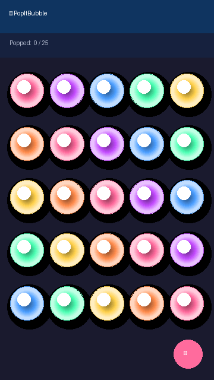
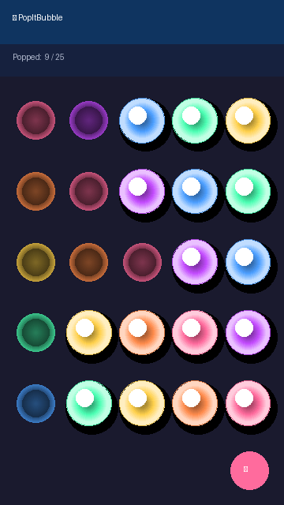
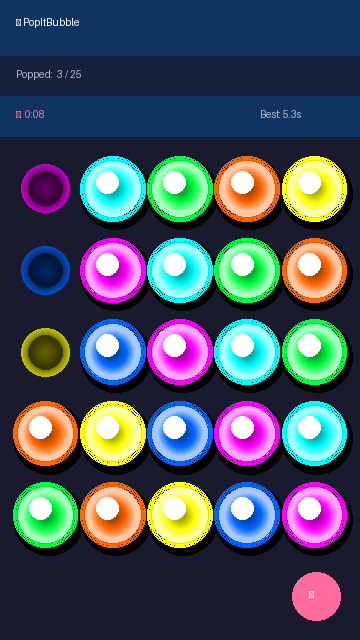

# 🫧 PopItBubble

[](https://github.com/HighviewOne/PopItBubble/actions/workflows/android.yml)
[](LICENSE)
[](https://developer.android.com)
[](https://kotlinlang.org)

A satisfying **Pop-It fidget sensory app** for Android. Tap or drag across the silicone-style bubbles to pop them — complete with 3D animations, haptic feedback, and satisfying pop sounds.

**[🌐 Live Demo & Landing Page →](https://highviewone.github.io/PopItBubble/)**

---

## Demo



| Rainbow grid | ⚡ Neon + Challenge Mode |
|:---:|:---:|
|  |  |

---

## Features

| Feature | Details |
|---|---|
| 🎨 **6 Color Themes** | Rainbow, Pink, Blue, Pastel, ⚡ Neon, 🍬 Candy |
| 📐 **4 Grid Sizes** | 4×4, 5×5, 6×6, 7×7 |
| 🔊 **Pop Sounds** | 4 programmatically-generated WAV variations with pitch randomization |
| 📳 **Haptic Feedback** | Crisp 25 ms vibration pulse on every pop |
| 👆 **Multi-Touch** | Drag multiple fingers to pop bubbles in one sweep |
| ✨ **3D Bubble Rendering** | RadialGradient dome with specular highlight using Canvas |
| 🎉 **Celebration** | Animated overlay + auto-reset when all bubbles are popped |
| 📊 **Pop Counter** | Live `X / Total` count in the header bar |
| ⚙️ **Settings** | Toggle sound and haptic feedback independently |
| ⏱️ **Challenge Mode** | Race the clock — timer starts on first pop, tracks personal best |

### How Challenge Mode works

1. Tap **⋮ → ⏱ Challenge Mode** to toggle it on. A timer bar appears below the pop counter.
2. The clock **doesn't start** until you pop your first bubble — no penalty for switching the menu or thinking.
3. Pop all bubbles as fast as you can. The clock stops the moment the last bubble pops.
4. Your time is shown in the celebration overlay (e.g. `🎉 4.2s! 🎉`).
5. If it's your fastest run, it's saved as your **personal best** and displayed next to the timer on every future run.
6. Tap ↺ (FAB or menu) to reset and try again. Best time persists across sessions.

---

## What's New in v1.1.0

- ⚡ **Neon theme** — electric magenta, cyan, matrix green, orange, yellow, blue with glow rim
- 🍬 **Candy theme** — bubblegum pink, tangerine, lemon, lime, sky blue, grape
- ⏱️ **Challenge Mode** — timed runs with personal best stored in SharedPreferences
- ⚙️ **Settings screen** — sound and haptic toggles that persist across launches
- 🧪 **Unit + UI tests** — 12 JVM tests (`GridMathTest`) and 4 Espresso tests (`BubblePopTest`)
- 🏗️ **CI** — GitHub Actions builds APK and runs lint on every push

---

## How to Build

### Requirements
- Android Studio **Giraffe (2022.3.1)** or newer
- JDK 17
- Android SDK with **API level 35** platform

### Steps

```bash
git clone https://github.com/HighviewOne/PopItBubble.git
cd PopItBubble
```

Open the folder in **Android Studio** — it will sync Gradle automatically.

Then press **▶ Run** or build from the terminal:

```bash
# macOS / Linux
./gradlew assembleDebug

# Windows
gradlew.bat assembleDebug
```

The debug APK will be at:
```
app/build/outputs/apk/debug/app-debug.apk
```

---

## Project Structure

```
PopItBubble/
├── app/src/
│   ├── main/java/com/popitbubble/
│   │   ├── MainActivity.kt       # Toolbar, menu, counter, celebration
│   │   ├── BubbleGridView.kt     # Custom View — Canvas drawing, touch, animation
│   │   ├── SoundManager.kt       # Programmatic WAV generation + SoundPool
│   │   ├── SettingsActivity.kt   # Sound / haptic toggle screen
│   │   ├── GridMath.kt           # Pure grid calculation utilities (testable)
│   │   └── Prefs.kt              # SharedPreferences wrapper
│   ├── test/java/com/popitbubble/
│   │   └── GridMathTest.kt       # JVM unit tests (no Android required)
│   └── androidTest/java/com/popitbubble/
│       └── BubblePopTest.kt      # Espresso UI tests
└── docs/                         # GitHub Pages landing page + assets
```

### Architecture

- **`BubbleGridView`** — single custom `View` drawing the entire grid on `Canvas`.
  Uses `RadialGradient` for the 3D dome effect and `ValueAnimator` with `OvershootInterpolator` for the pop spring-back.
- **`SoundManager`** — generates pop sounds at runtime: white noise + low-frequency tone + click transient, written to cache WAV files and played via `SoundPool` for sub-20 ms latency.
- **`GridMath`** — pure Kotlin object with zero Android dependencies, containing all geometric calculations (bubble radius, centre, hit-testing, colour blending). Fully unit-tested on the JVM.
- **Minimal dependencies** — AndroidX + Material Components + `kotlinx-coroutines-android` for async sound loading.

---

## Tech Highlights

| Area | Detail |
|---|---|
| **Custom rendering** | `BubbleGridView` bypasses XML layouts entirely — every bubble is drawn with `Canvas.drawCircle` + multi-stop `RadialGradient` for a convincing 3D silicone look |
| **Touch handling** | `onTouchEvent` iterates all active pointers on `ACTION_MOVE`, enabling true multi-finger drag-to-pop |
| **Sound synthesis** | Pop sounds are generated in-process (white noise envelope + low-frequency resonance) — no bundled audio assets, zero APK bloat |
| **Low-latency audio** | `SoundPool` (not `MediaPlayer`) keeps playback latency under 20 ms |
| **Haptics** | `VibrationEffect.createOneShot` on API 26+, with graceful fallback for older devices |
| **Animation** | `ValueAnimator` with `OvershootInterpolator` gives the characteristic "squish-and-spring" pop feel |
| **Testability** | All geometry logic is in `GridMath` — pure Kotlin, no Android deps, runs on the JVM in milliseconds |
| **UI tests** | 4 Espresso tests cover: counter initial state, pop increments counter, FAB reset, challenge bar visibility |

---

## Performance

| Metric | Value | Notes |
|---|---|---|
| **Render frame budget** | 16.7 ms (60 fps) | `ValueAnimator` is Choreographer-driven; invalidates only the animating bubble region |
| **Draw complexity** | O(n) per frame | Single `Canvas` pass — no nested layouts, no `RecyclerView` overhead |
| **Pop animation** | 220 ms / ~13 frames | `OvershootInterpolator` spring at 60 fps |
| **Sound latency** | ~15–25 ms | `SoundPool` vs. ~150–400 ms for `MediaPlayer` |
| **Haptic latency** | ~10 ms | `VibrationEffect.createOneShot` is low-level HAL call |
| **Touch → visual** | ≤ 1 frame (16 ms) | `invalidate()` called synchronously in `onTouchEvent` |
| **APK size** | ~5.5 MB | No bundled audio assets — sounds generated at first launch and cached |

---

## Roadmap

- [ ] Haptic strength slider
- [ ] High-score leaderboard
- [ ] Hexagonal grid layout
- [ ] Accessibility: screen reader support

---

## Download

Grab the latest debug APK from [Releases](https://github.com/HighviewOne/PopItBubble/releases/latest).

> Enable **Install from unknown sources** in Android Settings → Apps before installing.

---

## License

[MIT](LICENSE) © 2026 HighviewOne
