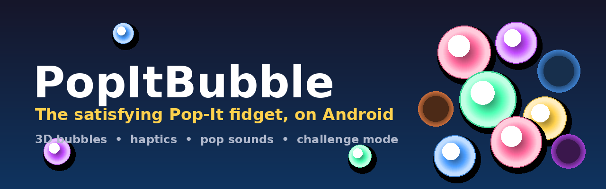
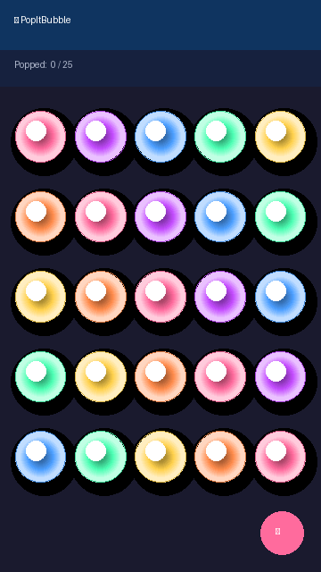
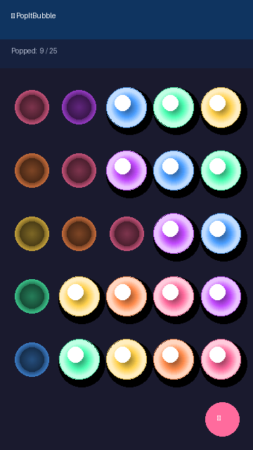
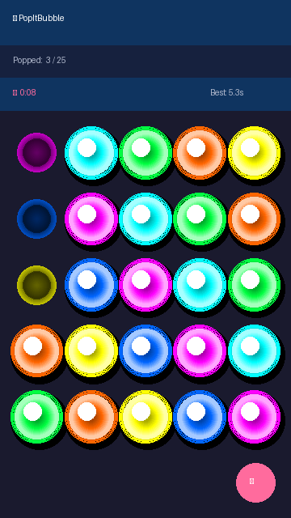

<div align="center">



<br/>

[](https://github.com/HighviewOne/PopItBubble/actions/workflows/android.yml)
[](LICENSE)
[](https://developer.android.com)
[](https://kotlinlang.org)
[](https://developer.android.com)
[](.github/PULL_REQUEST_TEMPLATE.md)

**A satisfying Pop-It fidget sensory app for Android.** Tap or drag across the silicone-style bubbles to pop them — complete with 3D animations, haptic feedback, and satisfying pop sounds.

[🌐 Live Demo](https://highviewone.github.io/PopItBubble/) &nbsp;•&nbsp; [⬇️ Download APK](https://github.com/HighviewOne/PopItBubble/releases/latest) &nbsp;•&nbsp; [🐛 Report a Bug](https://github.com/HighviewOne/PopItBubble/issues/new/choose)

</div>

---

## Demo



| Rainbow grid | ⚡ Neon + Challenge Mode |
|:---:|:---:|
|  |  |

---

## Features

| Feature | Details |
|---|---|
| 🎨 **6 Color Themes** | Rainbow, Pink, Blue, Pastel, ⚡ Neon, 🍬 Candy |
| 📐 **4 Grid Sizes** | 4×4, 5×5, 6×6, 7×7 |
| 🔊 **Pop Sounds** | 4 programmatically-generated WAV variations with pitch randomization |
| 📳 **Haptic Feedback** | Crisp 25 ms vibration pulse on every pop |
| 👆 **Multi-Touch** | Drag multiple fingers to pop bubbles in one sweep |
| ✨ **3D Bubble Rendering** | RadialGradient dome, specular highlight and soft drop shadow, pre-rendered as sprites |
| 🎉 **Celebration** | Animated overlay + auto-reset when all bubbles are popped |
| 📊 **Pop Counter** | Live `X / Total` count in the header bar |
| ⚙️ **Settings** | Toggle sound and haptic feedback independently |
| ⏱️ **Challenge Mode** | Race the clock — timer starts on first pop, tracks personal best |

### How Challenge Mode works

1. Tap **⋮ → ⏱ Challenge Mode** to toggle it on. A timer bar appears below the pop counter.
2. The clock **doesn't start** until you pop your first bubble — no penalty for switching the menu or thinking.
3. Pop all bubbles as fast as you can. The clock stops the moment the last bubble pops.
4. Your time is shown in the celebration overlay (e.g. `🎉 4.2s! 🎉`).
5. If it's your fastest run, it's saved as your **personal best** and displayed next to the timer on every future run.
6. Tap ↺ (FAB or menu) to reset and try again. Best time persists across sessions.

---

## What's New

New in v1.3.0:

- 🐛 **Game fixes** — correct pop counter on launch, Challenge Mode times no longer include the celebration delay, theme and grid changes no longer desync the counter or clock
- 📱 **Android 15 ready** — content stays clear of the status and navigation bars under enforced edge-to-edge
- ⚡ **Smoother rendering** — bubbles are pre-rendered sprites drawn with hardware acceleration
- 📦 **Smaller release APK** — R8 shrinking cuts it from ~5.9 MB to ~1.5 MB
- 🧪 **Espresso tests in CI** on an emulator, alongside unit tests and lint

See [CHANGELOG.md](CHANGELOG.md) for the full history.

---

## How to Build

### Requirements
- An Android Studio release that supports **AGP 9.4** (see the [compatibility table](https://developer.android.com/build/releases/gradle-plugin))
- JDK 17
- Android SDK with the **API level 37** platform (compileSdk 37, targetSdk 35)

### Steps

```bash
git clone https://github.com/HighviewOne/PopItBubble.git
cd PopItBubble
```

Open the folder in **Android Studio** — it will sync Gradle automatically.

Then press **▶ Run** or build from the terminal:

```bash
# macOS / Linux
./gradlew assembleDebug

# Windows
gradlew.bat assembleDebug
```

The debug APK will be at:
```
app/build/outputs/apk/debug/app-debug.apk
```

### Tests

```bash
./gradlew test                       # JVM unit tests
./gradlew connectedDebugAndroidTest  # Espresso tests (needs a device or emulator)
```

---

## Project Structure

```
PopItBubble/
├── app/src/
│   ├── main/java/com/popitbubble/
│   │   ├── MainActivity.kt       # Toolbar, menu, counter, celebration
│   │   ├── BubbleGridView.kt     # Custom View — Canvas drawing, touch, animation
│   │   ├── SoundManager.kt       # Programmatic WAV generation + SoundPool
│   │   ├── SettingsActivity.kt   # Sound / haptic toggle screen
│   │   ├── GridMath.kt           # Pure grid calculation utilities (testable)
│   │   ├── Theme.kt              # Colour themes
│   │   └── Prefs.kt              # SharedPreferences wrapper
│   ├── test/java/com/popitbubble/
│   │   └── GridMathTest.kt       # JVM unit tests (no Android required)
│   └── androidTest/java/com/popitbubble/
│       └── BubblePopTest.kt      # Espresso UI tests
├── docs/                         # GitHub Pages landing page + assets
└── tools/                        # Python scripts that generate docs/assets images
```

### Architecture

- **`BubbleGridView`** — single custom `View` drawing the entire grid on `Canvas`.
  Each colour's inflated and popped bubble (`RadialGradient` dome, highlight, blurred shadow) is rendered once into a bitmap sprite; `onDraw` blits the sprites with hardware acceleration. `ValueAnimator` with `OvershootInterpolator` drives the pop spring-back.
- **`SoundManager`** — generates pop sounds at runtime: white noise + low-frequency tone + click transient, written to cache WAV files and played via low-latency `SoundPool`.
- **`GridMath`** — pure Kotlin object with zero Android dependencies, containing the geometry (bubble radius, centre, hit-testing, sprite size) and colour blending. Unit-tested on the JVM.
- **Minimal dependencies** — AndroidX + Material Components + `kotlinx-coroutines-android` for async sound loading.

---

## Tech Highlights

| Area | Detail |
|---|---|
| **Custom rendering** | No per-bubble views: one `Canvas` pass draws the whole grid from cached bitmap sprites. The sprites are rendered in software once, so `BlurMaskFilter` shadows work while frames stay hardware-accelerated |
| **Touch handling** | `onTouchEvent` checks every active pointer on `ACTION_DOWN`, `ACTION_POINTER_DOWN` and `ACTION_MOVE`, enabling multi-finger drag-to-pop |
| **Sound synthesis** | Pop sounds are generated in-process (white noise envelope + low-frequency resonance) — no bundled audio assets |
| **Low-latency audio** | `SoundPool` (not `MediaPlayer`) for short, frequently repeated clips |
| **Haptics** | `VibrationEffect.createOneShot` on API 26+, with a fallback for older devices |
| **Animation** | `ValueAnimator` with `OvershootInterpolator` gives the characteristic "squish-and-spring" pop feel |
| **Edge-to-edge** | Window insets are applied to each screen, as required on Android 15 at targetSdk 35 |
| **Testability** | Geometry lives in `GridMath` — pure Kotlin, no Android deps, runs on the JVM in milliseconds |
| **UI tests** | Espresso tests cover the counter, popping, reset, Challenge Mode, theme switching and sprite rendering; CI runs them on an emulator |

---

## Performance

| Aspect | Detail |
|---|---|
| **Per-frame work** | Background gradient plus one bitmap blit per bubble (at most 49), hardware-accelerated |
| **Sprite cache** | Up to 12 bitmaps (inflated + popped for each theme colour), rebuilt only when the grid size or theme changes — about 2–3 MB |
| **Pop animation** | 220 ms `OvershootInterpolator` spring, Choreographer-driven |
| **APK size** | ~1.2 MB release (R8 + resource shrinking), ~7 MB debug — no bundled audio, sounds are generated on first launch and cached |

---

## Roadmap

- [ ] Haptic strength slider
- [ ] High-score leaderboard
- [ ] Hexagonal grid layout
- [ ] Accessibility: screen reader support

---

## Release signing

Pushing a `v*` tag runs `.github/workflows/release.yml`. The tag must match
`versionName` in `app/build.gradle` (e.g. `v1.2.0`). To publish a release-signed,
R8-shrunk APK, add these repository secrets:

| Secret | Value |
|---|---|
| `KEYSTORE_BASE64` | `base64 -w0 release.jks` |
| `KEYSTORE_PASSWORD` | keystore password |
| `KEY_ALIAS` | key alias |
| `KEY_PASSWORD` | key password |

Without them the workflow publishes a debug-signed APK and logs a warning.
For local signed builds, put `KEYSTORE_FILE`, `KEYSTORE_PASSWORD`, `KEY_ALIAS` and
`KEY_PASSWORD` in a gitignored `keystore.properties` at the repo root.

---

## Download

Grab the latest APK from [Releases](https://github.com/HighviewOne/PopItBubble/releases/latest).

> Enable **Install from unknown sources** in Android Settings → Apps before installing.

> Upgrading from v1.2.0 or earlier? Those APKs were debug-signed; uninstall the
> old version once before installing v1.3.0. Later updates install normally.

---

## License

[MIT](LICENSE) © 2026 HighviewOne
